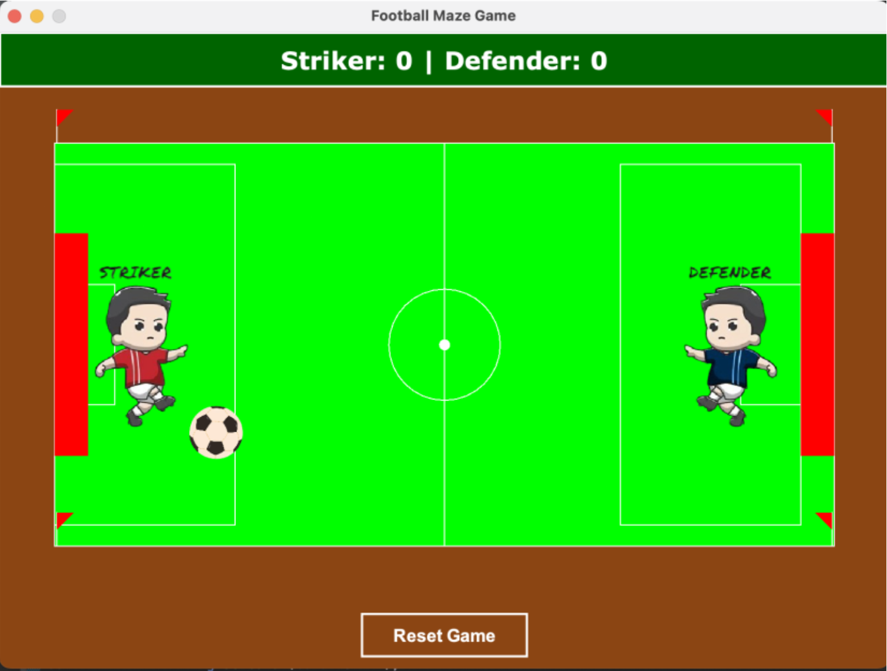

# FootMazeDuel

A two-player **Java Swing** football game where a striker faces off against a defender on a drawn pitch. Navigate your striker past the defender to score goals, complete with image sprites, sound effects, a live scoreboard, and JUnit tests.

> Built as a group project for the Bsc (Hons) Software Development 2 Programming module at Griffith College Dublin (2025).

---

## Team

This project was developed collaboratively by:

- Olimeh Kelvin  
- Tahseen Ahmad  
- Francis Ngonadi  
- Komarovskyi Denys  

---

## Gameplay

One player controls the **Striker**, the other controls the **Defender**. The striker's goal is to get the football past the defender and into the net. The defender's goal is to intercept and block the shot. The scoreboard tracks both players' scores in real time.

- **Goal scored** → crowd cheer sound plays, striker score increments
- **Defender saves** → save sound plays, defender score increments
- **Reset** → scores clear and the game restarts

---

## Screenshot

### Game Main Window
> The main gameplay interface showing player movement, football interaction, and goal mechanics in action.



---

## Project Structure

```
.
├── GamePanel.java # Main game loop (root entry version)
├── MainGame.java # Entry point to launch the game
│
├── images/ # Game sprites
│ ├── defender-img.png # Defender character image
│ ├── football-img.png # Football image
│ └── striker-img.png # Striker character image
│
├── sounds/ # Sound effects
│ ├── cheer.wav # Goal celebration sound
│ └── defender_save.wav # Defender save sound
│
└── src/
└── griffith/
├── Defender.java # Defender player logic
├── Football.java # Ball physics and movement
├── FootballTest.java # Unit tests for football logic
├── GamePanel.java # Core rendering and game loop
├── GamePanelTest.java # Unit tests for game panel
├── Goal.java # Goal detection logic
├── MainGame.java # Main launcher (packaged)
├── Sound.java # Sound handling system
└── Striker.java # Striker player logic
```

---

## Assets

### Sprites

| Asset | File | Used For |
|---|---|---|
| Striker | `images/striker.png` | Renders the striker character on the pitch |
| Defender | `images/defender.png` | Renders the defender character on the pitch |
| Football | `images/football.png` | Renders the ball as it moves across the field |

### Sounds

| Sound | File | Trigger |
|---|---|---|
| Crowd Cheer | `sounds/cheer.wav` | Plays when the striker scores a goal |
| Defender Save | `sounds/save.wav` | Plays when the defender successfully blocks the ball |

---

## Architecture

### `MainGame.java`
The application entry point creates a `JFrame` and displays a start menu with two buttons, **Start Game** and **Quit Game**. Clicking Start Game swaps the menu panel for a `GamePanel` instance.

### `GamePanel.java`
The core game panel, extending `JPanel`. Responsibilities include:
- Drawing the football pitch using `paintComponent` (green field, white boundary, halfway line, centre circle, goal areas)
- Displaying the live scoreboard (`Striker: X | Defender: X`) via a `JLabel` at the top
- Rendering the striker, defender, and football sprites from the `images/` folder
- Handling game resets via a Reset Game button

### `Football.java`
Manages the ball's position, velocity, and movement logic. Handles collision detection with the pitch boundaries and the defender's save area.

### `Striker.java`
Controls the striker character's position and movement. Handles keyboard input for the player controlling the striker.

### `Defender.java`
Controls the defender character. Handles movement/blocking logic to intercept the football before it reaches the goal.

---

## Testing

JUnit tests are included for two core classes:

### `FootballTest.java` → tests `Football.java`
- Verifies that the football initialises at the correct position
- Tests movement confirms position updates correctly after each step
- Tests boundary collision: ball should not go out of bounds
- Tests reset: ball returns to starting position after a goal or save

### `GamePanelTest.java` → tests `GamePanel.java`
- Verifies the panel initialises with a score of 0 for both players
- Tests score increment on goal and on save
- Tests that `resetGame()` correctly zeroes out both scores
- Verifies the scoreboard label text updates correctly

---

## Requirements

- Java 8+
- JUnit 4 or JUnit 5 (for running tests)
- An IDE like Eclipse or IntelliJ (the `.classpath` and `.project` files are included for Eclipse)

---

## How to Run

### In Eclipse
1. Clone or download the repository.
2. Open Eclipse → **File → Import → Existing Projects into Workspace**.
3. Select the `FootMazeDuel` folder.
4. Run `MainGame.java` as a Java Application.

### From the command line
```bash
# Compile
javac -d out src/griffith/*.java *.java

# Run
java -cp out griffith.MainGame
```

### Running Tests
```bash
# With JUnit on your classpath
javac -cp .:junit.jar src/griffith/FootballTest.java src/griffith/GamePanelTest.java
java -cp .:junit.jar:hamcrest.jar org.junit.runner.JUnitCore griffith.FootballTest griffith.GamePanelTest
```

---

## 🛠️ Built With

- [Java](https://www.java.com/), core language
- [Java Swing](https://docs.oracle.com/javase/8/docs/technotes/guides/swing/), GUI framework (`JFrame`, `JPanel`, `JLabel`, `JButton`)
- `javax.sound`, audio playback for cheer and save sounds
- [JUnit](https://junit.org/), unit testing

---

## License

Built as a group college assignment for the Bsc (Hons) Software Development 2 Programming module at Griffith College Dublin (2025).
